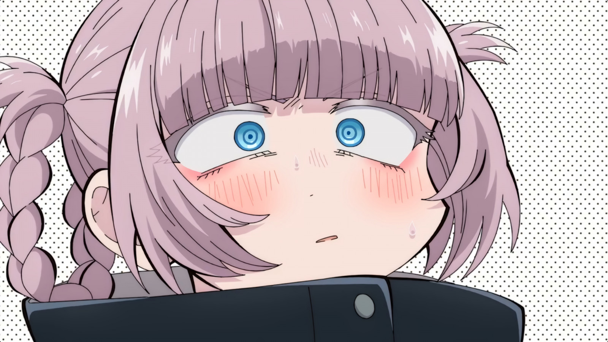

# Hi, I'm rkrz (MrMastered)

**just a silly guy on the internet**

---

  
<b>more about me</b>

  
  <h3>experience</h3>
  
  <h4>Web Stack</h4>
  
  
  
  
  
  
   
  <h4>other Stuff I Do</h4>
  <ul>
    <li>sipping coffee and writing questionable code</li>
    <li>Reading random docs for fun</li>
  </ul>

---

## 📈 GitHub Stats

---

> "Why write perfect code when you can write code that works and fix it later?"

---

feel free to say hi, or just stalk my repos :D
